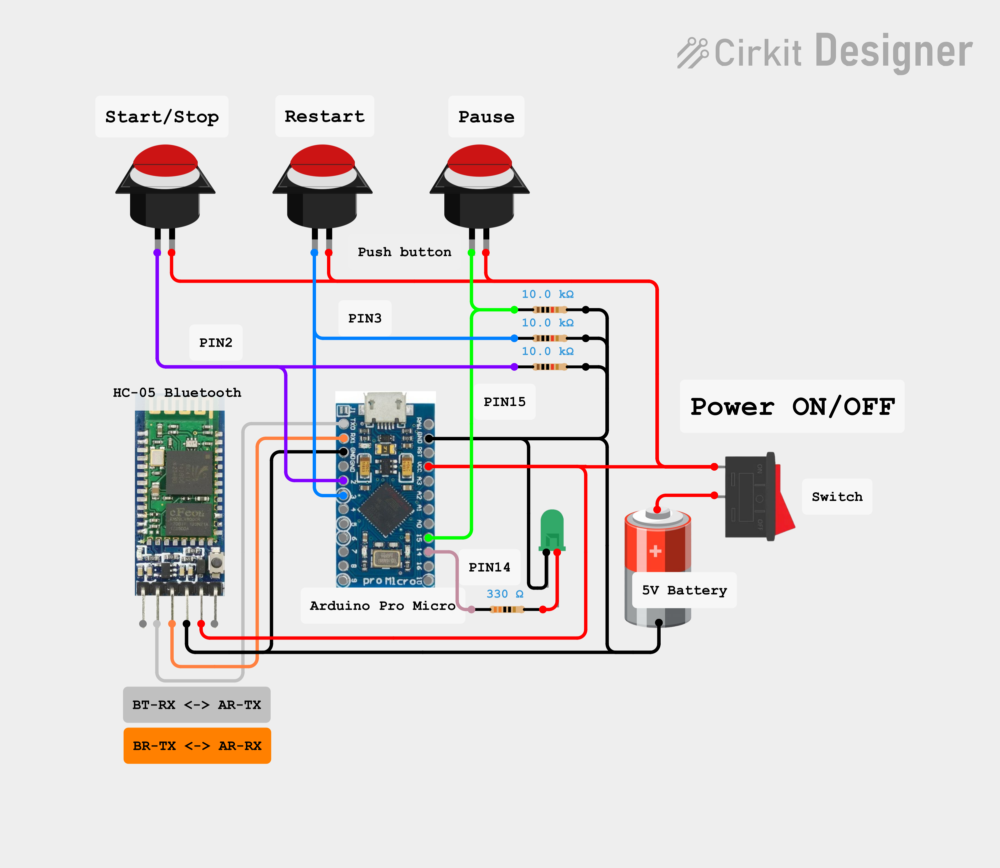

# PlayBox for Unity

Sistema de controle físico para o Editor da Unity, pensado para desenvolvimento e testes em Realidade Virtual.

---

## Índice

- [Introdução](#introdução)
- [Funções do sistema](#funções-do-sistema)
- [Versões da Unity suportadas](#versões-da-unity-suportadas)
- [Como criar / instalar](#como-criar--instalar)
  - [1. Montagem do hardware com Arduino Pro Micro](#1-montagem-do-hardware-com-arduino-pro-micro)
    - [1.1. Componentes](#11-componentes)
    - [1.2. Diagrama do circuito](#12-diagrama-do-circuito)
  - [2. Unity](#2-unity)
    - [2.1. Release](#21-release)
    - [2.2. Scripts C#](#22-scripts-c)
- [Como usar](#como-usar)
  - [1. Parear dispositivos Bluetooth no Windows](#1-parear-dispositivos-bluetooth-no-windows)
  - [2. Uso em projetos na Unity](#2-uso-em-projetos-na-unity)

---

## Introdução

O **PlayBox** é um sistema de **hardware + software** criado para facilitar o ciclo de testes em projetos de **Realidade Virtual** desenvolvidos na **Unity**.

Em vez de tirar o headset (HMD) toda vez que você precisa clicar em **Play**, **Pause** ou **Restart** no Editor, o PlayBox permite controlar essas ações por meio de uma pequena caixa física com botões, baseada em **Arduino Pro Micro** e **Bluetooth (HC-05/HC-06)**.

Este repositório contém:

- Firmware para o **Arduino Pro Micro**;
- **Scripts C# para Unity** (Editor/runtime);
- Orientações de montagem do hardware e integração com o projeto Unity.

---

## Funções do sistema

O PlayBox foi pensado para reduzir o atrito no desenvolvimento e teste de cenas VR. Entre suas principais funções:

- **Controle do Editor da Unity via botões físicos**
  - Botão **Play/Stop** → entra e sai do *Play Mode*;
  - Botão **Restart** → reinicia a cena atual;
  - Botão **Pause** → pausa / retoma a execução do jogo.

- **Conexão sem fio via Bluetooth (HC-05 ou HC-06)**
  - Comunicação serial com o PC por porta COM virtual;
  - Serviço em C# na Unity que interpreta os comandos recebidos.

- **Janela de controle na Unity**
  - Seleção de porta serial e baud rate;
  - Botões para **Conectar / Desconectar / Reconnect**;
  - Exibição de status (desabilitado, conectando, conectado etc.).

- **Feedback visual no hardware**
  - LED ligado quando o sistema está ativo;
  - Pisca ao receber comandos dos botões.

O objetivo é permitir que você **controle o ciclo de execução** (Play / Restart / Pause) sem precisar interagir diretamente com o Editor da Unity, mantendo o foco dentro da experiência VR.

---

## Versões da Unity suportadas

O PlayBox foi desenvolvido e testado principalmente em:

- **Unity 2022.3 LTS**
- **Unity 6 / 6000.x** (testes pontuais)

Em princípio, qualquer versão **Unity 2021.3+** com suporte a .NET Standard 2.x e Editor para Windows tende a funcionar, mas ainda não foi exaustivamente testada.

> **Recomendação:** utilizar **Unity 2022.3 LTS ou superior**.

---

## Como criar / instalar

### 1. Montagem do hardware com Arduino Pro Micro

#### 1.1. Componentes

Lista básica de componentes:

- **1x Arduino Pro Micro** (5V)
- **1x Módulo Bluetooth HC-05** (ou **HC-06**)
- **1x bateria 5V** (ou alimentação USB equivalente)
- **1x LED verde**
- **1x switch** (liga/desliga geral)
- **3x push buttons** do tipo botoeira
- **3x resistores 10kΩ** (para pull-down dos botões)
- **1x resistor 330Ω** (para o LED)
- **1x caixa de plástico** para acomodar tudo
- **Fios** (jumpers ou fios rígidos/flexíveis)

Sugestão: prototipe em uma protoboard antes de montar na caixa definitiva.

#### 1.2. Diagrama do circuito

O diagrama elétrico do sistema está disponível em:

```text
./src/circuit-diagram/circuit_diagram.png
```

Você pode visualizar diretamente no GitHub ou incluir a imagem no README:



**Mapeamento de pinos sugerido (ajuste conforme o firmware):**

- **Botões:**
  - `PIN 2` → Botão **Play/Stop**
  - `PIN 3` → Botão **Restart**
  - `PIN 15` → Botão **Pause**

- **LED:**
  - `PIN 14` → LED do sistema  
    - LED em série com **resistor de 330Ω** para o GND.

- **Módulo Bluetooth (HC-05 / HC-06):**
  - `TX (Arduino Pro Micro)` → `RX (HC-05)`
  - `RX (Arduino Pro Micro)` → `TX (HC-05)`
  - `VCC (HC-05)` → 5V
  - `GND (HC-05)` → GND

- **Botões (exemplo de ligação):**
  - Um lado do botão → 5V  
  - Outro lado do botão → pino digital (2, 3 ou 15) **+ resistor 10kΩ para GND**  
  - O resistor de 10kΩ funciona como **pull-down**, mantendo o pino em nível baixo quando o botão não está pressionado.

---

### 2. Unity

#### 2.1. Release

1. Acesse a aba **Releases** deste repositório no GitHub.
2. Baixe o pacote na versão desejada, por exemplo:
   - `PlayBoxUnity-x.y.z.unitypackage`  
   ou  
   - um `.zip` contendo a pasta `Assets/...`.
3. No Unity:
   - Vá em **Assets > Import Package > Custom Package...**
   - Selecione o `.unitypackage` baixado;
   - Importe todos os arquivos necessários.

#### 2.2. Scripts C#

Se preferir clonar o repositório ou usar o `.zip`:

1. Faça o **clone** ou **download** do repositório.
2. Localize a pasta com os scripts do PlayBox (por exemplo:  
   `Assets/PiXR/PlayBox/` ou estrutura equivalente).
3. Copie essa pasta para dentro da pasta `Assets` do seu projeto Unity.
4. Aguarde o Unity recompilar os scripts.

Após isso, você deverá ter acesso:

- Ao serviço principal (por exemplo, `PlayBoxService.cs`);
- À janela de Editor (por exemplo, `PlayBoxWindow.cs`);
- A eventuais prefabs ou assets auxiliares necessários.

> Ajuste os nomes acima conforme a estrutura real do seu projeto.

---

## Como usar

### 1. Parear dispositivos Bluetooth no Windows

1. Ligue o PlayBox (bateria ou USB) com o módulo HC-05/HC-06 conectado.
2. Coloque o módulo em modo de pareamento, se necessário (depende da configuração padrão).
3. No **Windows**:
   - Abra **Configurações > Dispositivos > Bluetooth e dispositivos**;
   - Ative o Bluetooth;
   - Procure pelo dispositivo (ex.: `HC-05`) e clique em **Emparelhar**.
4. Descubra a **porta COM** associada:
   - Abra o **Gerenciador de Dispositivos**;
   - Vá em **Portas (COM & LPT)**;
   - Anote a porta (ex.: `COM4`, `COM9`, etc.).

Essa porta será utilizada dentro da Unity para conectar ao PlayBox.

---

### 2. Uso em projetos na Unity

1. Abra o projeto Unity que já contém os scripts do PlayBox.
2. Certifique-se de que:
   - O PlayBox está ligado;
   - O módulo Bluetooth está emparelhado com o Windows;
   - Você sabe qual é a porta COM associada.

3. No Unity, abra a janela do PlayBox (exemplo):
   - **Window > PiXR > PlayBox**  
     > Ajuste de acordo com o menu/nome da janela do seu projeto.

4. Na janela do PlayBox:
   - Habilite o sistema (ex.: marque **Enabled** ou similar);
   - Selecione a **porta COM** correspondente (ex.: `COM9`);
   - Ajuste o **baud rate** (por exemplo, `115200`);
   - Clique em **Connect**.

5. Com o status em **Connected**, teste:

   - **Botão Play/Stop**  
     - Entra e sai do *Play Mode* no Editor.

   - **Botão Restart**  
     - Reinicia a cena atual.

   - **Botão Pause**  
     - Pausa / retoma a execução do jogo.

6. Fluxo típico em VR:

   - Deixe a cena pronta e o PlayBox conectado;
   - Coloque o HMD;
   - Quando estiver posicionado, pressione o botão **Play** na caixa;
   - Use o botão **Restart** para repetir o teste sem tirar o headset;
   - Use **Pause** se precisar congelar a execução em um momento específico.

---