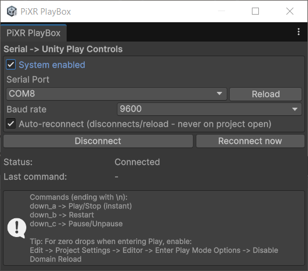

# PlayBox for Unity

Physical control system for the Unity Editor, designed for eXtended Reality development and testing.
[Portuguese Version](README-PT.md)
---

## Table of Contents

- [Introduction](#introduction)
- [System Features](#system-features)
- [Supported Unity Versions](#supported-unity-versions)
- [How to Build / Install](#how-to-build--install)
  - [1. Hardware Assembly with Arduino Pro Micro](#1-hardware-assembly-with-arduino-pro-micro)
    - [1.1. Components](#11-components)
    - [1.2. Circuit Diagram](#12-circuit-diagram)
  - [2. Unity](#2-unity)
    - [2.1. Release](#21-release)
    - [2.2. C# Scripts](#22-c-scripts)
- [How to Use](#how-to-use)
  - [1. Pair Bluetooth Devices on Windows](#1-pair-bluetooth-devices-on-windows)
  - [2. Using It in Unity Projects](#2-using-it-in-unity-projects)

---

## Introduction

**PlayBox** is a **hardware + software** system created to streamline the testing cycle in **eXtended Reality** projects developed with **Unity**.

Instead of taking off the headset (HMD) every time you need to hit **Play**, **Pause**, or **Restart** in the Editor, PlayBox lets you trigger these actions through a small physical box with buttons, based on an **Arduino Pro Micro** and **Bluetooth (HC-05 / HC-06)**.

This repository contains:

- Firmware for the **Arduino Pro Micro**;
- **C# scripts for Unity** (Editor/runtime);
- Instructions for hardware assembly and Unity integration.

---

## System Features

PlayBox was designed to reduce friction when iterating on VR scenes. Main features include:

- **Unity Editor control via physical buttons**
  - **Play/Stop button** → enters and exits *Play Mode*;
  - **Restart button** → restarts the current scene;
  - **Pause button** → pauses / resumes game execution.

- **Wireless connection via Bluetooth (HC-05 or HC-06)**
  - Serial communication with the PC through a virtual COM port;
  - A Unity C# service that receives and interprets the commands.

- **Custom Editor window**
  - Select serial port and baud rate;
  - Buttons for **Connect / Disconnect / Reconnect**;
  - Status display (disabled, connecting, connected, etc.).

- **Visual feedback on the hardware**
  - LED on when the system is active;
  - LED blinks when a button command is sent.

The goal is to let you **control the run-loop** (Play / Restart / Pause) without touching the Unity Editor UI, keeping your focus inside the VR experience.

---

## Supported Unity Versions

PlayBox has been developed and tested mainly with:

- **Unity 2022.3 LTS**
- **Unity 6 / 6000.x** (limited testing)

In principle, any **Unity 2021.3+** version with .NET Standard 2.x support and the Windows Editor should work, but not all combinations have been exhaustively tested.

> **Recommendation:** use **Unity 2022.3 LTS or newer**.

---

## How to Build / Install

### 1. Hardware Assembly with Arduino Pro Micro

#### 1.1. Components

Basic component list:

- **1x Arduino Pro Micro** (5V)
- **1x Bluetooth module HC-05** (or **HC-06**)
- **1x 5V battery** (or equivalent USB power)
- **1x green LED**
- **1x power switch** (on/off)
- **3x push buttons** (momentary push type)
- **3x 10kΩ resistors** (for button pull-down)
- **1x 330Ω resistor** (for the LED)
- **1x plastic enclosure** (case)
- **Wires** (jumpers or solid/flexible wires)

Tip: prototype everything on a breadboard before soldering it into the final enclosure.

#### 1.2. Circuit Diagram

The circuit diagram is available at: [here](src/circuit-diagram/circuit_diagram.png).

  

**Suggested pin mapping (adjust to match your firmware):**

- **Buttons:**
  - `PIN 2` → **Play/Stop** button
  - `PIN 3` → **Restart** button
  - `PIN 15` → **Pause** button

- **LED:**
  - `PIN 14` → System LED  
    - LED in series with a **330Ω resistor** to GND.

- **Bluetooth module (HC-05 / HC-06):**
  - `TX (Arduino Pro Micro)` → `RX (HC-05)`
  - `RX (Arduino Pro Micro)` → `TX (HC-05)`
  - `VCC (HC-05)` → 5V
  - `GND (HC-05)` → GND

- **Buttons (example wiring):**
  - One side of each button → 5V  
  - Other side → digital pin (2, 3 or 15) **and** 10kΩ resistor to GND  
  - The 10kΩ resistor acts as a **pull-down**, keeping the input LOW when the button is not pressed.

---

### 2. Unity

> **⚠️ Important:** For PlayBox to work correctly in Unity, you must change the **API Compatibility Level** of your project:
> `Edit > Project Settings > Player > Other Settings > Api Compatibility Level` → select **.NET Framework** instead of **.NET Standard 2.1**.

#### 2.1. Release

1. Go to the **Releases** page of this repository on GitHub.
2. Download the package you want, for example:
   - `PlayBoxUnity-1.0.1.unitypackage`  ->   [Go to Releases](https://github.com/CamiloJr/unity-playbox/releases).
   or  
   - a `.zip` containing the `Assets/...` folder.
3. In Unity:
   - Open **Assets > Import Package > Custom Package...**
   - Select the `.unitypackage` you downloaded;
   - Import all required files.

#### 2.2. C# Scripts

If you prefer to clone or download the repository directly:

1. **Clone** or **download** this repository.
2. Locate the folder containing the PlayBox scripts (for example:  
   `Assets/PiXR/PlayBox/` or a similar structure).
3. Copy this folder into the `Assets` folder of your Unity project.
4. Wait for Unity to recompile the scripts.

You should now have access to:

- The main service script (for example, `PlayBoxService.cs`);
- The custom editor window (for example, `PlayBoxWindow.cs`);
- Any required prefabs or supporting assets.

> Adjust the names above to match your actual project structure.

---

## How to Use

### 1. Pair Bluetooth Devices on Windows

1. Turn on the PlayBox (battery or USB) with the HC-05/HC-06 module connected.
2. Put the module into pairing mode if needed (depends on its configuration).
3. On **Windows**:
   - Open **Settings > Devices > Bluetooth & devices**;
   - Enable Bluetooth;
   - Find the device (e.g., `HC-05`) and click **Pair**.
4. Find out which **COM port** was assigned:
   - Open **Device Manager**;
   - Go to **Ports (COM & LPT)**;
   - Note the COM port (e.g., `COM4`, `COM9`, etc.).

This COM port will be used inside Unity to connect to the PlayBox.

---

### 2. Using It in Unity Projects

1. Open the Unity project that already contains the PlayBox scripts.
2. Make sure:
   - The PlayBox hardware is powered on;
   - The Bluetooth module is paired with Windows;
   - You know the corresponding COM port.

3. In Unity, open the PlayBox window (example):
   - **Window > PiXR > PlayBox**  
     > Adjust according to the actual menu path in your project.
     

        
      

4. In the PlayBox window:
   - Enable the system (e.g., check **Enabled** or a similar toggle);
   - Select the correct **COM port** (e.g., `COM9`);
   - Set the **baud rate** (for example, `9600`);
   - Click **Connect**.

5. Once the status shows **Connected**, test the buttons:

   - **Play/Stop button**  
     - Enters and exits *Play Mode* in the Editor.

   - **Restart button**  
     - Restarts the current scene.

   - **Pause button**  
     - Pauses / resumes game execution.

6. Typical VR workflow:

   - Prepare your scene and connect PlayBox;
   - Put on the headset;
   - When you are ready, press the **Play** button on the box;
   - Use **Restart** to repeat the test without removing the headset;
   - Use **Pause** if you need to freeze the simulation at a specific moment.
